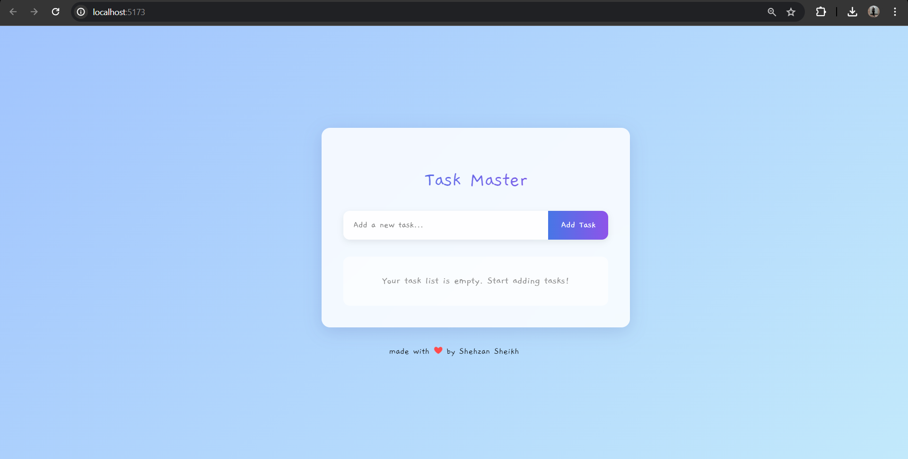

# To-Do List

This is a simple To-Do List project that I created a long time ago when I was learning web development. It was one of my early projects where I explored the basics of React, component-based UI, and state management.

## Features
-  Add new tasks
-  Mark tasks as completed
-  Delete tasks
-  Interactive UI with animations
-  LocalStorage for task persistence

## Tech Stack
- **React** (with Vite)
- **CSS** (custom styling)
- **JavaScript** (state management)

## Installation
```bash
git clone https://github.com/shehzansk/To-Do-List.git
cd dolist
npm install
npm run dev
```

## Screenshots
 <br>
 

## Live Demo
[Click here to view the live project]([#](https://to-do-list-vkfr.onrender.com/))

---

Made with ❤️ by **Shehzan Sheikh**
EOF
